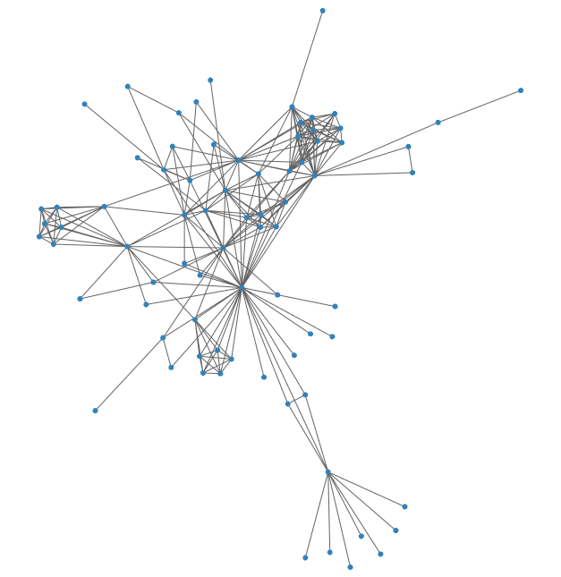
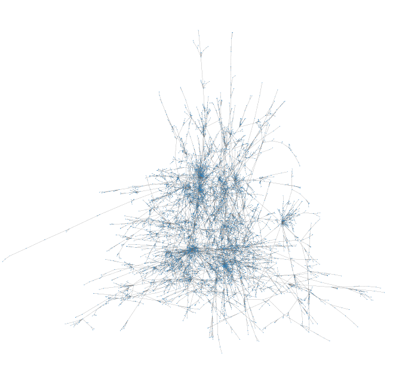

# sigmaNet

Render `igraph` networks using Sigma.js - in R - now on CRAN!

<a href = 'https://iankloo.github.io/sigmaNet/'>Check out the full docs</a>

## Why?

This package is an R interface to the <a href = 'https://github.com/jacomyal/sigma.js'>Sigma.js</a> javascript library. Sigma.js was built for graph visualization and has significant advantages over other javascript libraries when creating large graph visualizations.  

Benefits of this package:

1. Use familiar, well documented `igraph` objects to make visualizations
2. Easy "ggplot-like" syntax
3. Render things quickly - allowing for faster iterative graph building
4. Render large networks
5. Maintain interactivity (click, hover, zoom) with sharable html output
6. Integrate easily with Shiny applications

## How?

First, install this package:

```
install.packages('sigmaNet')
```

Or, use the development version:

```
devtools::install_github('iankloo/sigmaNet')
```

Then, create an `igraph` network.  Here we'll use the included les Miserables dataset that maps the co-appearances of characters in the novel.

Note, passing an optional layout to the `sigmaFromIgraph()` function will dramatically improve speed.  Layouts are usually the most computationally intensive task when creating network visualizations.  This package allows you to separate this computation from the aesthetic changes you will likely want to make to your visualization.

```
library(sigmaNet)
library(igraph)

data(lesMis)

layout <- layout_with_fr(lesMis)
sig <- sigmaFromIgraph(lesMis, layout = layout)
sig
```



If you render this at home, you'll see that you can zoom, pan, and get information on-hover for the nodes.  This is just a static image to show you the basics.

## Options

You have a few options available to change the aesthetics of graphs. Options are applied in a similar way to `ggplot`, but use the pipe operator instead of the "+".  Here is an example showing most of the options you can use:

```
data(lesMis)

clust <- cluster_edge_betweenness(lesMis)$membership
V(lesMis)$group <- clust

layout <- layout_with_fr(lesMis)

sig <- sigmaFromIgraph(lesMis, layout = layout) %>%
  addNodeLabels(labelAttr = 'label') %>%
  addEdgeSize(sizeAttr = 'value', minSize = .1, maxSize = 2) %>%
  addNodeSize(sizeMetric = 'degree', minSize = 2, maxSize = 8) %>%
  addNodeColors(colorAttr = 'group', colorPal = 'Set1')
sig
```


Note: there is no opacity/transparency/alpha attribute!  That is because webgl doesn't support transparency.  To mimic transparency, set your edge size to be small - this works really well.  I know this is a big trade off, but it is the only way to render large networks without sacrificing performance.  
## Larger Networks

This package was built to address the specific challenges of creating compelling visualizations with large networks.  Here is an example of a larger network than we've been using (created using a graph-generating function in `igraph`):

```
g <- sample_pa(10000)

layout <- layout_with_fr(g)
sig <- sigmaFromIgraph(g, layout = layout)
sig %>%
  addNodeSize(oneSize = .5) %>%
  addEdgeSize(oneSize = .2)
```



While we can debate the usefulness of a "hairball" graph like this, you can see that `sigmaNet` has no problem rendering a graph with 10,000 nodes nearly instantly.  If you render this at home, you will also see that the graph maintains its interactivity with little to no lag.

## Shiny Support

You can use `sigmaNet` in Shiny using `renderSigmaNet()` in your server and `sigmaNetOutput()` in your ui.  See the <a href = 'https://shiny.rstudio.com/tutorial/'>Shiny docs</a> for more general info about Shiny - these functions drop-in just like the basic plotting examples.  

## A Note on Browsers

This package uses a renderer that detects whether or not your browser supports webgl.  If it does, webgl will be used to render the visualizations.  If not, canvas will be used.  Webgl is MUCH faster than canvas (especially with large graphs), so if you notice some performance issues, try using a modern browser that supports webgl.  All but the most out-of-date browsers support webgl (except maybe Opera?), so this shouldn't be an issue for many.

## Features in development

- GUI to modify aesthetics (Shiny gadget)

Write an "issue" on the <a href = "https://github.com/iankloo/sigmaNet/issues">github page</a> for this package if you want to see additional features.


